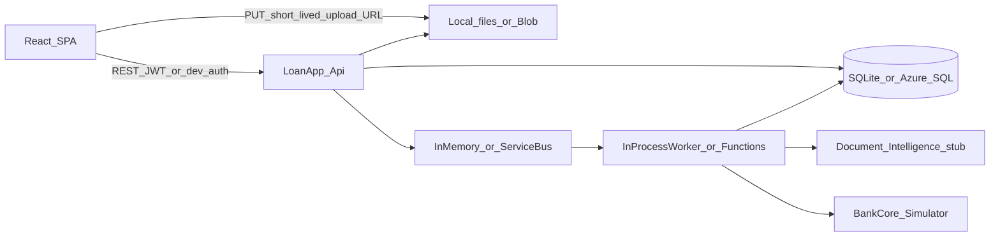
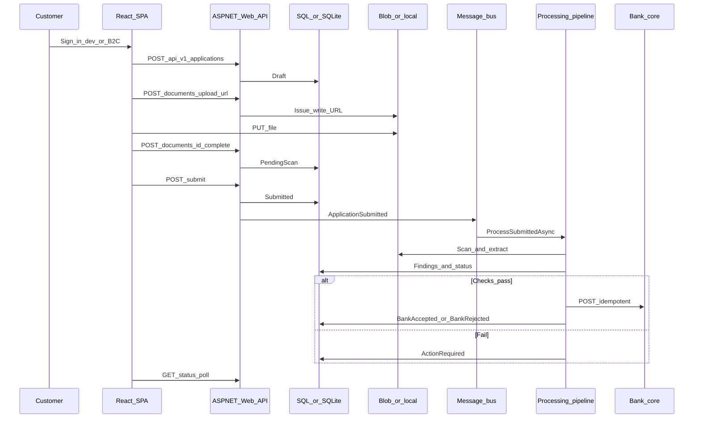

# Loan Application — System Design

This document describes the **as-built** system: a customer-facing loan apply-and-upload portal. Applicants create a draft, upload required documents, submit, and track status. Verification and posting to a bank core run in the background. There is **no bank-officer UI** in v1.

React talks **only** to a versioned ASP.NET Core Web API. The browser never talks to SQL, blob storage, Azure OpenAI, or the bank core.

---

## 1. Goals and non-goals

### Goals (v1)

- Applicant-only portal (create, update draft, upload docs, submit, poll status).
- Stable `/api/v1` contract so a mobile app or officer portal can reuse the same APIs later.
- Async verification (scan, extract, rules) then an **idempotent** post to a bank-core HTTP API.
- Swap local adapters (SQLite, local files, in-memory bus) for Azure (SQL, Blob, Service Bus) without changing the API surface.
- Leave seams for Azure OpenAI later (`IVerificationEngine`, `ILoanAssistant`, feature flags, integration events).

### Non-goals (v1)

- Bank officer review UI.
- Disbursement, EMI, repayment.
- Live credit bureau or full KYC vendor.
- Generative AI in the customer UI (interfaces only).
- Blazor or any server-rendered .NET UI.

---

## 2. High-level architecture



**Rule:** React is a client of `LoanApp.Api`. Functions, the bank simulator, and any future AI models are not called from the browser.

---

## 3. Solution layout

| Path | Role |
|---|---|
| `apps/web` | React (Vite) SPA — list, apply, upload, poll status |
| `src/LoanApp.Api` | ASP.NET Core Web API, OpenAPI, CORS, auth |
| `src/LoanApp.Application` | Use cases, domain, rules engine, processing pipeline |
| `src/LoanApp.Infrastructure` | EF Core, blob, bus, bank HTTP client, scan/OCR stubs |
| `src/LoanApp.Functions` | Azure Functions Service Bus trigger (production-style processor) |
| `src/LoanApp.BankCore.Simulator` | Stand-in bank HTTP API (`POST /applications`) |
| `infra/` | Bicep + `azure.yaml` for Azure |
| `docker-compose.yml` | Local multi-container run |

---

## 4. Runtime: local vs Docker vs Azure

| Concern | Local `dotnet run` | Docker Compose | Azure |
|---|---|---|---|
| UI | Vite `localhost:5173` | nginx in `web` on `5173` | Static Web Apps |
| API | `localhost:5088` | `api` on `5088` | App Service |
| Bank | `localhost:5090` | `bank` on `5090` | Same simulator or real core |
| Database | **SQLite** file `loanapp.db` | **SQLite** in volume `loan-db` (`/app/data/loanapp.db`) | **Azure SQL** |
| Documents | Folder `blobs/` | Volume `loan-blobs` | **Azure Blob** (private) |
| Messaging | In-memory channel | In-memory in API container | **Azure Service Bus** queue |
| Processor | `InProcessApplicationWorker` in the API | Same, inside `api` | **Azure Functions** on the queue |
| Identity | Development auth (`X-User-Id`, default `dev-user`) | Same | Entra External ID (B2C) JWT |
| OCR / scan | Filename stubs | Same | Stub until Document Intelligence is wired |

**Compose does not run a database server.** SQLite is a file inside the API container, persisted on a named volume. Production is Azure SQL via `Database__Provider=SqlServer`.

Azure Functions is **not** in Compose: the API already processes `ApplicationSubmitted` in-process.

---

## 5. End-to-end flow



### Application states

`Draft` → `Submitted` → `Verifying` → `ActionRequired` **or** `SentToBank` / `BankAccepted` / `BankRejected`

Applicants may change profile/documents only in **Draft** or **ActionRequired**.

---

## 6. HTTP API (`/api/v1`)

Base URL locally: `http://localhost:5088`  
OpenAPI: `http://localhost:5088/openapi/v1.json`

Auth: `[Authorize]` on product and application routes. Development handler succeeds for every request; optional header `X-User-Id`. Production: JWT bearer (`Auth:Authority`, `Auth:Audience`).

Errors: JSON `{ "code", "message", "details" }`.

| Method | Path | Purpose |
|---|---|---|
| GET | `/api/v1/loan-products` | Products and required document types |
| POST | `/api/v1/applications` | Create draft |
| GET | `/api/v1/applications` | List current user (`page`, `pageSize`) |
| GET | `/api/v1/applications/{id}` | Application + checklist + findings |
| PUT | `/api/v1/applications/{id}` | Update draft / action-required profile |
| POST | `/api/v1/applications/{id}/documents/upload-url` | Short-lived write URL |
| POST | `/api/v1/applications/{id}/documents/{documentId}/complete` | Confirm blob exists |
| POST | `/api/v1/applications/{id}/submit` | Lock and enqueue (`Idempotency-Key` recommended) |
| GET | `/api/v1/applications/{id}/status` | Lightweight poll |
| PUT/POST | `/api/v1/dev/uploads/{token}` | **Development only** — receive local file PUT |

### Planned later (not implemented)

- `POST /api/v1/applications/{id}/assistant/messages`
- `GET /api/v1/applications/{id}/insights`
- Officer: `POST /api/v1/applications/{id}/ai/summarize`

### Bank simulator (not a public SPA API)

- `POST /applications` — headers `X-Api-Key`, `Idempotency-Key`
- `GET /health`

---

## 7. Domain model

### Products and documents

| Product | Required documents |
|---|---|
| Personal | IdProof, AddressProof, IncomeProof |
| Home | IdProof, AddressProof, IncomeProof, BankStatement |
| Auto | IdProof, AddressProof, IncomeProof |

### Main entities (EF Core)

- **LoanApplication** — applicant user id, product, amount, tenure, profile, status, reason code, bank reference, `DecisionEngine`
- **LoanDocument** — type, blob path, lifecycle, scan flag, `ExtractedJson`, confidence
- **VerificationFinding** — code, message, passed, engine (audit of rules vs future Azure OpenAI)

### Document lifecycle

`PendingUpload` → `PendingScan` → `ScanFailed` or `Extracted`

### Verification rules (`RulesVerificationEngine`)

- Completeness (required docs extracted and scan passed)
- Readable (filename must not contain `unreadable` / `blur`; confidence ≥ 0.5)
- ID not expired (filename `expired` on IdProof)
- Name / DOB match when extraction provides them (stub often leaves them null → pass)
- Income vs amount: `monthlyIncome * 12 * 0.4 >= amount`

Malware stub: fail if filename contains `virus`, `eicar`, or ends with `.exe`.

---

## 8. Processing pipeline

`ApplicationProcessingPipeline.ProcessSubmittedAsync`:

1. Load application; skip if already sent/accepted.
2. Set `Verifying`.
3. For each `PendingScan` document: malware scan → OCR extract → persist JSON facts → publish `DocumentExtracted`.
4. Run `IVerificationEngine`; replace findings; publish `VerificationCompleted`.
5. On fail: `ActionRequired` + first failing reason code.
6. On pass: `IBankCoreClient.SubmitAsync` with `Idempotency-Key` = application id → `BankAccepted` or `BankRejected`.

Local/Docker: `InMemoryMessageBus` + `InProcessApplicationWorker`.  
Azure: `AzureServiceBusMessageBus` + `ApplicationSubmittedFunction`.

---

## 9. Security (v1)

- TLS in Azure (`httpsOnly`); local HTTP.
- Blobs private; write URLs expire in ~5 minutes (SAS or local ticket).
- CORS: SPA origin only (`http://localhost:5173` in Compose).
- Managed Identity in Bicep for API/Functions to Blob, Service Bus, Key Vault.
- User-delegation SAS when the blob client has no account key.
- Development upload endpoint disabled outside Development.
- Do not log full document contents or ID numbers.
- Future AI: keys only on server; `IBankCoreClient` remains the only writer to the bank.

---

## 10. Azure resources (Bicep)

Provisioned by `infra/main.bicep` (also referenced from `azure.yaml`):

- App Service (Linux) — API  
- Function App (isolated .NET 9) — queue processor  
- Static Web Apps — React  
- Azure SQL + firewall allow Azure  
- Storage account + `loan-documents` container + Blob CORS for SPA PUT  
- Service Bus queue `loan-applications`  
- Key Vault, Log Analytics, Application Insights  
- User-assigned identities + RBAC (Blob Data Contributor, Blob Delegator, Service Bus sender/receiver, Key Vault Secrets User)

Feature flags `AiAssistant` / `AiVerificationAssist` stay `false` until OpenAI is added.

---

## 11. Adding AI later

v1: rules + OCR stub. Models must attach **server-side**.

- After extract: optional LLM review writing the **same** status codes.
- Customer assistant: new routes, grounded on application JSON + FAQ — not raw PDFs unless privacy allows.
- Flags: `FeatureFlags:AiAssistant`, `FeatureFlags:AiVerificationAssist`.
- Events already published: `ApplicationSubmitted`, `DocumentExtracted`, `VerificationCompleted`.
- `DecisionEngine` records `Rules` today; later `AzureOpenAI`.

Reserved Azure: Azure OpenAI / AI Foundry, optional Azure AI Search. Document Intelligence is the extract source; later AI should consume structured JSON.

---

## 12. How to run

### Three processes (no Docker)

1. `dotnet run --project src/LoanApp.BankCore.Simulator`  
2. `dotnet run --project src/LoanApp.Api`  
3. `cd apps/web && npm install && npm run dev`  

Portal: http://localhost:5173

### Docker Compose

```bash
docker compose up --build
```

Same host ports: web `5173`, API `5088`, bank `5090`.  
`docker compose down -v` removes SQLite and blob volumes.

---

## 13. Technology stack

- .NET 9, ASP.NET Core, EF Core 9 (SQLite / SQL Server)
- React 19, Vite 6, React Router 7
- Azure.Storage.Blobs, Azure.Messaging.ServiceBus, Azure.Identity
- Azure Functions Worker (isolated) + Service Bus trigger
- Docker (sdk/aspnet 9, node 22, nginx 1.27)

---

## 14. Out of scope / follow-ups

- Entra External ID tenant wiring and MSAL in React  
- Real Azure AI Document Intelligence (replace `StubDocumentIntelligenceClient`)  
- SQL Server container in Compose if local should match Azure SQL  
- Worker Service / Container Apps instead of Functions (optional simplification)  
- Officer portal on the same `/api/v1` host with extra roles  
